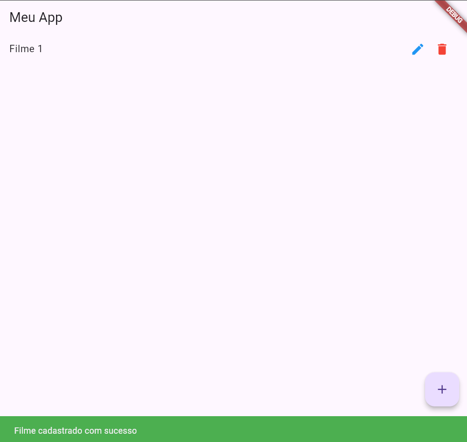
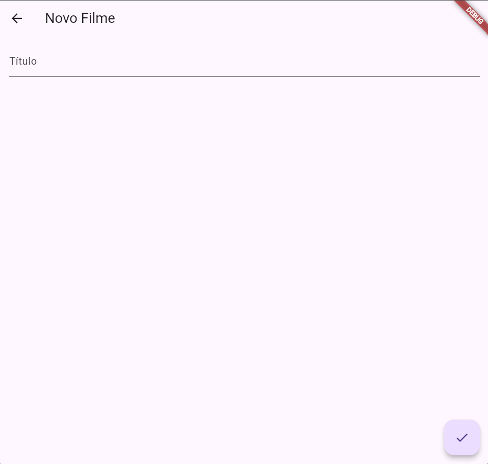
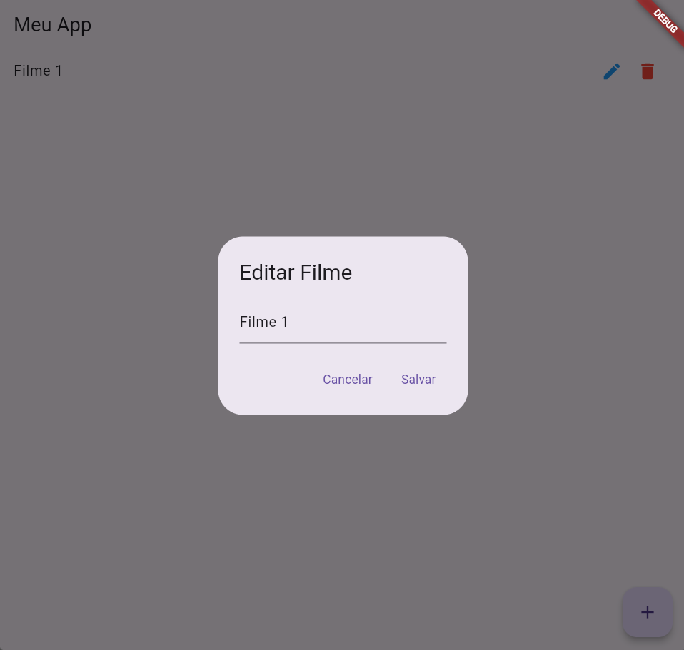

# 🎬 Aplicação de Cadastro de Filmes com Flutter + API REST

Este projeto é uma aplicação simples desenvolvida em Flutter, com integração a uma API REST, que permite **cadastrar, editar, listar e deletar filmes**.

A aplicação foi desenvolvida com o objetivo de praticar conceitos de consumo de APIs, manipulação de dados e desenvolvimento de interfaces com Flutter.

---

## 🚀 Funcionalidades

- 📜 Listar filmes cadastrados
- ➕ Adicionar novo filme
- ✏️ Editar título de um filme
- 🗑️ Remover filme da lista

---

## 🎥 Demonstração

<!-- Se quiser, adicione um print aqui -->




---

## 🛠️ Tecnologias utilizadas

- Flutter (Dart)
- HTTP Client (pacote `http`)
- API REST (Node.js, Express ou qualquer outro backend que forneça os endpoints)
- Flutter Web (executando no navegador) ou Mobile (Android/iOS)

---

## 🔗 API - Endpoints esperados

A aplicação consome uma API com os seguintes endpoints:

| Método | Endpoint          | Descrição                |
|--------|-------------------|--------------------------|
| GET    | `/filmes`         | Lista todos os filmes    |
| POST   | `/filmes`         | Adiciona um novo filme   |
| PUT    | `/filmes/{id}`    | Atualiza um filme pelo ID|
| DELETE | `/filmes/{id}`    | Deleta um filme pelo ID  |

**Exemplo de JSON de filme:**

```json
{
  "id": 1,
  "titulo": "Vingadores"
}
```

---

## 📦 Instalação e execução

### 🔧 Pré-requisitos

- Flutter instalado na máquina ([Download Flutter](https://docs.flutter.dev/get-started/install))
- Editor de código (VSCode, Android Studio, etc.)
- API backend em execução na mesma máquina ou na nuvem

### 🚀 Passos para executar

1. Clone o repositório:

```bash
git clone https://github.com/MMCAC/cx-ifms-tsi-pmd-ex-5.git
```

2. Acesse o diretório do projeto:

```bash
cd lib
```

3. Instale as dependências:

```bash
flutter pub get
```

4. Execute no navegador (Web) ou emulador:

```bash
flutter run -d chrome
```

ou para dispositivos móveis:

```bash
flutter run
```

---

## 📂 Estrutura de pastas

```
lib/
 ┣ API/
 ┃ ┗ server.js
 ┣ Models/
 ┃ ┗ Filme.dart
 ┣ Pages/
 ┃ ┗ FormCadastro.dart
 ┃ ┗ MeuApp.dart
 ┣ Services/
 ┃ ┗ FilmeService.dart
 ┣ main.dart
```

---

## 🐞 Possíveis problemas

- 🔥 **Erro ao rodar no navegador via botão "Run without debugging" no VSCode:**  
Recomendado executar pelo terminal usando `flutter run -d chrome`, que seleciona automaticamente uma porta disponível.

- 🔗 **API não encontrada (localhost):**  
Se estiver executando no Flutter Web, certifique-se que a API backend esteja acessível na rede local ou configure CORS corretamente.

---

## 🤝 Contribuição

Sinta-se à vontade para abrir issues, enviar PRs ou sugerir melhorias. 😉

---

## 📝 Licença

Este projeto é de uso acadêmico e livre para estudos.
